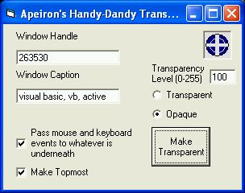



## Apeiron's Handy\-Dandy Transparencierizer

### Description

This handy utility makes other windows transparent (hence the name) but what is unique and the reason I wrote it is it also can change those windows to pass through mouse and keyboard input to the window below it.

The reason I originally wrote this was when I was writing papers for school I spent more time flipping back and forth than typing the paper. I needed something so I could read the reference and type at the same time.

I'm posting this because of chris seelbachs recent submission that covered the screen with a form you can't click through, this solves that while keping the transparency.

Try it I think you'll find it useful. Just remember that I wrote this for myself, so it's not well commented and that make sure you switch the window back to opaque before you drag to find another window (or it will be stuck transparent and unclickable)

Have fun with it.

----

Update

----

I've added hot key support

Ctrl-O (Opaque) Changes the target window opaque

Ctrl-T (Transparent) Changes the target window transparent

Ctrl-U (program on top) Brings the transparencierizer to the top so you can change the settings

Ctrl-D (program normal) Makes the transparencierizer normal (not on top)

and fixed a bug, thanks NMMorrison for pointing it out.

It would make windows pass mouse and keyboard input even if that option wasn't selected.

Fixed
 
### More Info
 
none (Just remember to set the window back to opaque!)

             |
---                |---
**Submitted On**   |2005-05-12 14:58:34
**By**             |[Apeiron](https://github.com/Planet-Source-Code/PSCIndex/blob/master/ByAuthor/apeiron.md)
**Level**          |Intermediate
**User Rating**    |5.0 (55 globes from 11 users)
**Compatibility**  |VB 4\.0 \(32\-bit\), VB 5\.0, VB 6\.0
**Category**       |[Graphics](https://github.com/Planet-Source-Code/PSCIndex/blob/master/ByCategory/graphics__1-46.md)
**World**          |[Visual Basic](https://github.com/Planet-Source-Code/PSCIndex/blob/master/ByWorld/visual-basic.md)
**Archive File**   |[Apeiron's\_1887565122005\.zip](https://github.com/Planet-Source-Code/apeiron-apeiron-s-handy-dandy-transparencierizer__1-60484/archive/master.zip)

### API Declarations

Several

